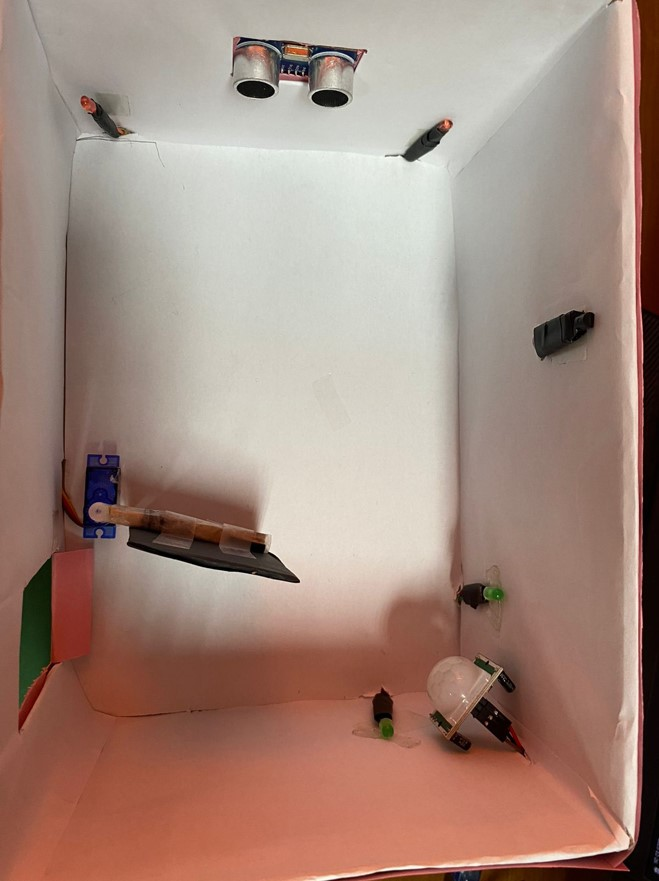

# Smart Home Automation Project README

## Overview
This project is a home automation system designed to enhance security, provide environmental feedback, and monitor temperature within a home environment. It utilizes various sensors, actuators, and an Arduino Uno microcontroller for its operation.

## Components
- PIR Motion Sensor: Detects movement within its specified range.
- LDR (Light Dependent Resistor): Detects ambient light levels.
- LEDs and Arduino Uno: Conveys information through visual cues.
- Temperature Sensor (LM35): Monitors temperature changes.
- Servo Motor: Controls the movement of the door.
- Ultrasonic Sensor: Measures distances for user proximity detection.
 

## How It Works
1. **PIR Motion Sensor**: Detects human presence and triggers actions accordingly.
2. **LDR**: Detects darkness and activates the servo motor to open the door for enhanced security.
3. **LEDs and Arduino Uno**: Provide visual feedback through green LEDs for motion detection and red LEDs for ultrasound detection.
4. **Temperature Sensor**: Monitors temperature changes to keep users informed about their surroundings.
5. **Servo Motor**: Collaborates with the LDR to control the door's movement swiftly and precisely.
6. **Ultrasonic Sensor**: Measures distances to determine user proximity and adjusts surrounding lighting accordingly.

## Installation
1. **Hardware Setup**: Connect the sensors, actuators, and Arduino Uno according to the provided schematics.
2. **Software Installation**: Upload the Arduino code provided in the project repository to the Arduino Uno.

## Usage
1. Power on the system.
2. The PIR motion sensor detects movement and triggers the appropriate response.
3. The LDR detects darkness and activates the servo motor to open the door.
4. LEDs provide visual feedback on environmental conditions.
5. The temperature sensor continuously monitors temperature changes.
6. The ultrasonic sensor measures distances for user proximity detection.

## Future Improvements
- Explore advanced security measures such as facial recognition or voice authentication.
- Integrate the system with IoT platforms for remote monitoring and control.
- Implement energy-saving measures for enhanced efficiency.
- Develop a user-friendly interface for a more accessible experience.
- Expand sensor capabilities to address a broader range of environmental factors.
- Incorporate machine learning algorithms for personalized and efficient operation.

